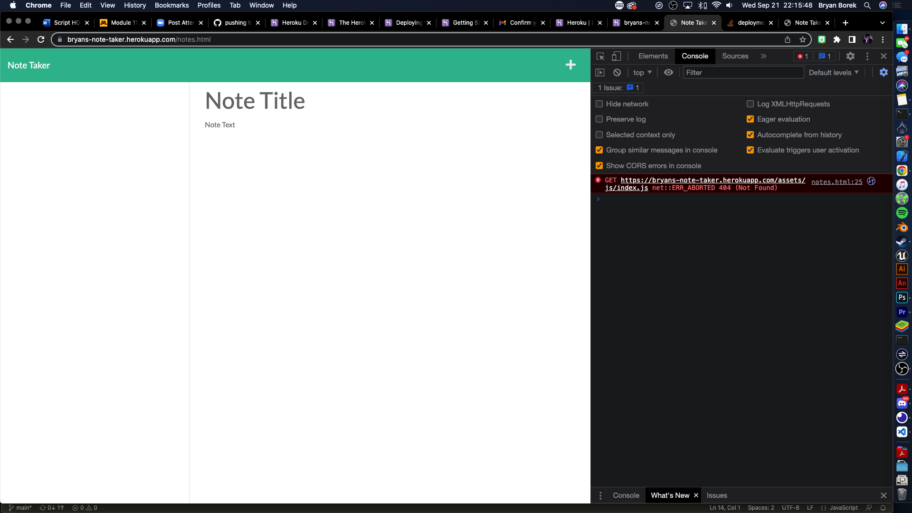

# 11-Note-Taker

## Keep track of your ideas and tasks!

```
This is an application for taking notes and saving them to a server.
There is a landing page and a note taking page.
You can save a note by pressing the "floppy disc" icon that only appears after you've wretten a note title and content.
After its saved, it appears to the left hand side.
You can select the saved notes from the left side if you would like to view them again.
```

## Mock-up



## Links

Github repository link: https://github.com/BryanBorek/11-Note-Taker

Heroku site URL: https://bryans-note-taker.herokuapp.com/
